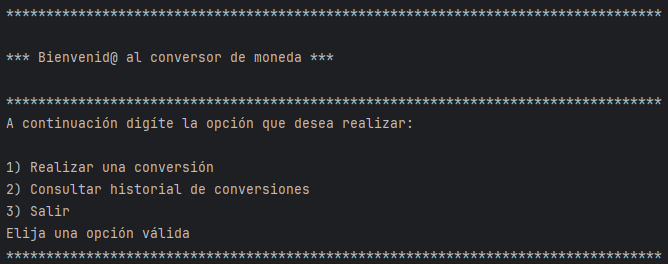
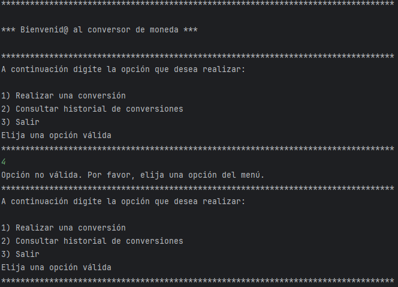
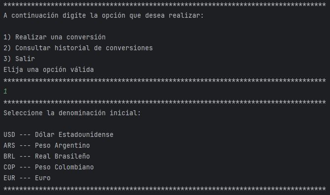
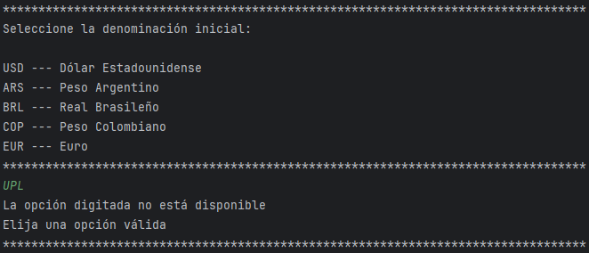
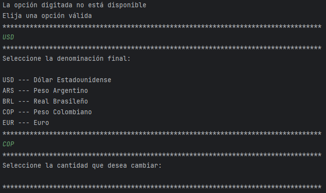
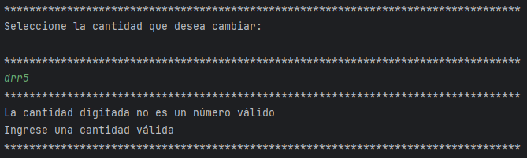
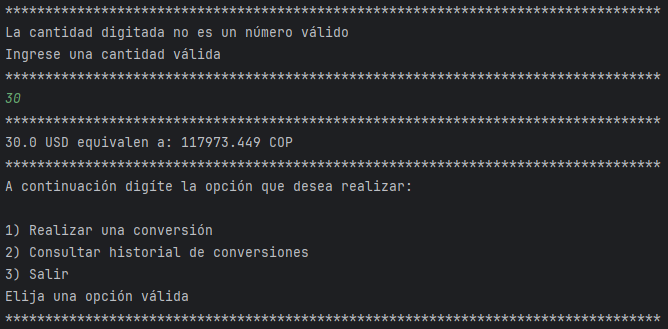
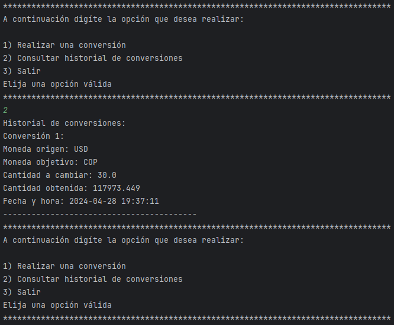
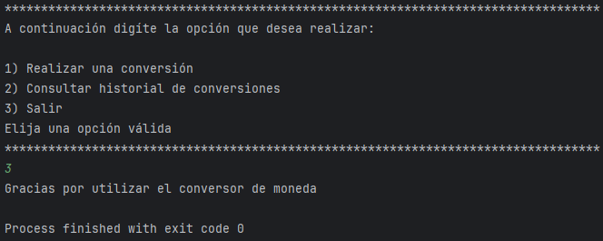

# Conversor de Monedas
Este proyecto consiste en un programa de JAVA, se trata de un conversor de monedas que recibe del usuario una moneda base, una moneda objetivo y una cantidad a cambiar. Realiza una solicitud a la API de ExchangeRate-API para procesar los datos y generar la respuesta.

## Funcionalidades

- Realizar una conversión de una moneda a otra.
- Consultar el historial de conversiones realizadas.

## Requisitos

- Java 8 o superior.
- Acceso a internet para consultar las tasas de cambio en tiempo real.

## Uso

1. Ejecutar el programa `Principal.java`.
2. Seguir las instrucciones del menú para realizar conversiones o consultar el historial.

### Ejemplo de uso:

A continuación de muestra un ejemplo con posibles entradas de usuario y respuestas del programa

 **Ejecutar el programa:**
   - Abre una terminal o línea de comandos.
   - Navega hasta el directorio donde se encuentra el archivo Principal.java.
   - Compila el archivo Principal.java utilizando el comando `javac Principal.java`.
   - Ejecuta el programa compilado utilizando el comando `java Principal`.
     
 **Iniciando el programa:**
Luego de ejecutar el programa, se mostrará el siguiente menú, en el cual el usuario deberá escoger la opción a realizar digitándo el número correspondiente.

Si el usuario ingresa una opción diferente se mostrará un mensaje de opción inválida y deberá ingresar nuevamente una opción.

 **Ingresando monedas:**
 Si el usuario ingresa la opción 1 en el menú principal, se mostrará el siguiente menú, en el cual deberá seleccionar la moneda base o de origen de la conversión ingresando las tres letras correspondientes a la denominación. 

Si el usuario ingresa una opción diferente a las opciones disponibles se mostrará un mensaje de opción no disponible y deberá ingresar nuevamente una moneda disponible.

Cuando el usuario ha ingresado una moneda base válida deberá escoger una moneda objetivo, de igual manera si ingresa una moneda no disponible deberá ingresar una moneda válida. Luego de esto deberá ingresar la cantidad a convertir.

 **Ingresando cantidad a convertir:**
Si el usuario ingresa una cantidad inválida (diferente de un número), deberá ingresar nuevamente una cantidad válida.

Cuando el usuario ha introducido una cantidad válida, se imprimirá el resultado y la información de la conversión solicitada.

 **Consultando historial de conversiones:**
En el menú principal, el usuario puede digitar la opción 2 para ver el historial detallado de conversiones realizadas con fecha y hora de estas.

 **Saliendo del programa:**
 Finalmente, el usuario puede seleccionar la opción 3 para terminar el programa.

## Dependencias

- Gson: Utilizado para manejar los datos JSON obtenidos de la API.
- Java HttpClient: Para realizar las solicitudes HTTP a la API de ExchangeRate-API.

## Cómo Contribuir

Si deseas contribuir a este proyecto, sigue estos pasos:

1. Haz un fork del repositorio.
2. Crea una nueva rama (`git checkout -b feature/nueva-funcionalidad`).
3. Realiza tus cambios y haz commit (`git commit -am 'Agrega nueva funcionalidad'`).
4. Sube tus cambios (`git push origin feature/nueva-funcionalidad`).
5. Abre un Pull Request.

## Autor

Fredy Alexander Garcia Cardozo
